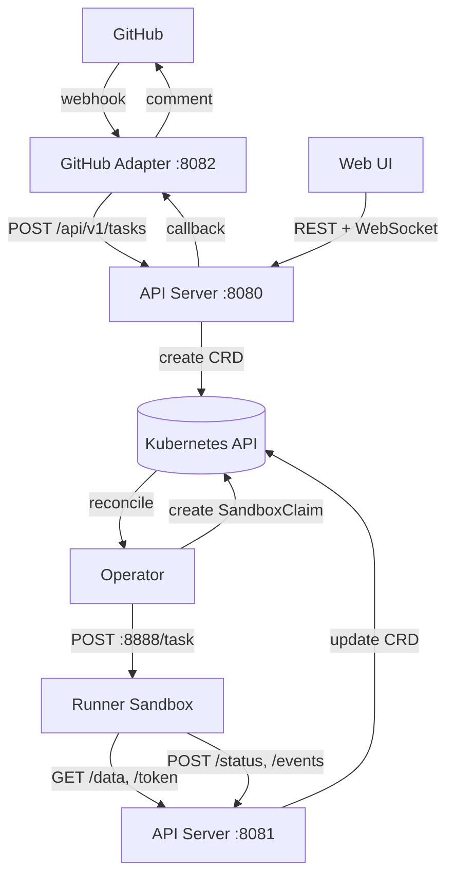

Shepherd consists of four deployments and ephemeral runner sandboxes, all running inside a Kubernetes cluster. This page covers the component architecture, the full task lifecycle, and the internal mechanisms that hold it all together.

## Components

### API Server

The API server exposes two HTTP ports:

| Port | Audience | Endpoints |
|------|----------|-----------|
| **:8080** (public) | Adapters, web UI, external clients | `POST /api/v1/tasks`, `GET /api/v1/tasks`, `GET /api/v1/tasks/{taskID}`, `GET /api/v1/tasks/{taskID}/events` (WebSocket) |
| **:8081** (internal) | Runner sandboxes only | `POST /api/v1/tasks/{taskID}/status`, `POST /api/v1/tasks/{taskID}/events`, `GET /api/v1/tasks/{taskID}/data`, `GET /api/v1/tasks/{taskID}/token` |

The internal port should be protected with a NetworkPolicy to prevent access from outside the cluster's sandbox network. Runners use this port to fetch task data, obtain a one-time GitHub token, stream events, and report completion.

Both ports share the same middleware stack (request ID, real IP, panic recovery, content-type enforcement on POST/PUT/PATCH) and the same graceful shutdown logic (10-second drain).

### GitHub Adapter

The adapter bridges GitHub and Shepherd. It has two roles:

1. **Webhook receiver** — listens for `issue_comment` events, detects `@shepherd` mentions, assembles context from the issue, and creates tasks via the API.
2. **Callback handler** — receives signed callbacks from the API server when tasks complete or fail, and posts the result as a GitHub comment.

The adapter uses the **Trigger App** GitHub App for authentication (issues read/write permissions).

### Operator

The operator is a standard controller-runtime reconciler watching `AgentTask` CRDs. When a new task appears, it:

1. Creates a `SandboxClaim` to request a sandbox from the agent-sandbox operator.
2. Waits for the sandbox to become ready.
3. Assigns the task to the runner by POSTing to `http://{sandboxFQDN}:8888/task`.
4. Monitors the sandbox lifecycle and handles timeouts and termination.

The operator re-queues tasks every 5 minutes as a safety net, with faster 5-second re-queues during state transitions.

### Web Frontend

A Svelte 5 SPA served by nginx. It displays tasks, streams real-time events via WebSocket, and provides filtering and search. The nginx container proxies `/api/` requests to the API server.

### Runner Sandbox

Ephemeral pods managed by the [agent-sandbox operator](https://agent-sandbox.sigs.k8s.io/docs/). Each sandbox runs a runner container that:

1. Receives a task assignment on `POST :8888/task`
2. Fetches task data and a one-time GitHub token from the internal API
3. Clones the repo, does the work (e.g., runs Claude Code), and creates a PR
4. Streams progress events back to the API
5. Reports completion or failure

Sandboxes are defined by `SandboxTemplate` resources that specify the container image, resource limits, volumes, and security context.

## Task Lifecycle

A task flows through 10 steps from a GitHub comment to a result posted back on the issue:

### 1. Webhook Received

GitHub sends an `issue_comment` webhook to the adapter. The adapter verifies the `X-Hub-Signature-256` HMAC-SHA256 signature and checks the event type.

### 2. Mention Detected

The adapter scans the comment body for `@shepherd` using the regex `(?i)(?:^|\s)@shepherd\b`. Only `created` actions are processed — edits and deletes are ignored.

### 3. Deduplication Check

Before creating a task, the adapter calls `GET /api/v1/tasks?active=true` filtered by repository and issue labels. If an active task already exists for the same issue, it posts an "already running" comment and stops.

### 4. Context Assembly

The adapter fetches all comments on the issue and assembles them into a context string with `## Issue Description` and `## Comments` sections. The context is capped at 1 MB; if it exceeds this limit, it's truncated with a notice.

### 5. Task Creation

The adapter calls `POST /api/v1/tasks` with the repo URL, task description, compressed context, callback URL, and labels. The API server creates an `AgentTask` CRD in the configured namespace.

### 6. Operator Reconciliation

The operator detects the new `AgentTask`, sets the `Succeeded` condition to `Pending` (Unknown), and creates a `SandboxClaim` with the same name as the task.

### 7. Sandbox Ready

When the agent-sandbox operator provisions the sandbox and marks the `SandboxClaim` as `Ready=True`, Shepherd's operator reads the sandbox's `ServiceFQDN` from the status.

### 8. Task Assignment

The operator POSTs `{"taskID": "...", "apiURL": "..."}` to `http://{sandboxFQDN}:8888/task`. On success (HTTP 200 or 409), it sets the task status to `Running` and records `startTime`.

### 9. Runner Execution

The runner fetches task data, obtains a one-time GitHub token, clones the repository, performs the work, streams progress events, and reports completion via `POST /api/v1/tasks/{taskID}/status`.

### 10. Callback and GitHub Comment

When the API server receives a terminal status (`completed` or `failed`), it sets the `ConditionNotified` condition to `CallbackPending` and sends a signed callback to the adapter. The adapter posts a comment on the original GitHub issue with the result (including a PR link if available).

## CRD Model: AgentTask

The `AgentTask` CRD (`toolkit.shepherd.io/v1alpha1`) is the central data structure.

### Spec

| Field | Type | Description |
|-------|------|-------------|
| `repo.url` | string | Repository HTTPS URL (immutable) |
| `repo.ref` | string | Git ref (optional) |
| `task.description` | string | What the runner should do |
| `task.context` | string | Issue context (gzip+base64 when `contextEncoding: gzip`) |
| `task.sourceURL` | string | GitHub issue URL |
| `task.sourceType` | enum | `""`, `"issue"`, `"pr"`, `"fleet"` |
| `task.sourceID` | string | Issue number as string |
| `callback.url` | string | Where to send completion callbacks |
| `runner.sandboxTemplateName` | string | Which SandboxTemplate to use |
| `runner.timeout` | duration | Default `30m` |
| `runner.serviceAccountName` | string | Optional SA for the sandbox pod |
| `runner.resources` | ResourceRequirements | Optional resource overrides |

The `repo` and `task` fields are **immutable** — they cannot be changed after creation (enforced by CEL validation rules).

### Status

| Field | Type | Description |
|-------|------|-------------|
| `observedGeneration` | int64 | Last reconciled generation |
| `startTime` | Time | When the runner was assigned |
| `completionTime` | Time | When the task reached a terminal state |
| `sandboxClaimName` | string | Name of the associated SandboxClaim |
| `result.prURL` | string | Pull request URL (on success) |
| `result.error` | string | Error message (on failure) |
| `graceDeadline` | Time | Sandbox termination grace window end |
| `tokenIssued` | bool | Prevents token replay (one-time use) |

### Conditions

**`Succeeded`** — primary lifecycle condition:

| Reason | Status | Meaning |
|--------|--------|---------|
| `Pending` | Unknown | Waiting for sandbox |
| `Running` | Unknown | Runner is executing |
| `Succeeded` | True | Task completed successfully |
| `Failed` | False | Task failed |
| `TimedOut` | False | Sandbox expired or claim expired |
| `Cancelled` | False | Task was cancelled |

A task is **terminal** when the `Succeeded` condition exists and its status is not `Unknown`.

**`Notified`** — callback delivery tracking:

| Reason | Status | Meaning |
|--------|--------|---------|
| `CallbackPending` | Unknown | Callback queued |
| `CallbackSent` | True | Callback delivered |
| `CallbackFailed` | True | Callback delivery failed |

## Sandbox Lifecycle

1. **SandboxClaim created** — the operator creates a claim with the same name as the `AgentTask`.
2. **Sandbox provisioned** — the agent-sandbox operator creates a pod from the referenced `SandboxTemplate`.
3. **Ready** — the claim's `Ready` condition becomes `True`, exposing the `ServiceFQDN`.
4. **Task assigned** — the operator POSTs to the runner on port 8888.
5. **Execution** — the runner works on the task.
6. **Termination** — when the sandbox expires or the task completes, the claim's `Ready` condition becomes `False`.
7. **Grace period** — the operator waits 30 seconds after detecting termination, giving the runner time to report its final status.
8. **Classification** — if the grace period expires without a status update, the operator classifies the termination: `SandboxExpired`/`ClaimExpired` reasons map to `TimedOut`, all others map to `Failed`.

## EventHub: Real-Time Streaming

The EventHub is an in-memory pub/sub system that powers real-time event streaming to the web UI.

- **Ring buffer**: each task stores up to **1,000 events**. When the buffer is full, the oldest event is dropped.
- **Subscriber channels**: each WebSocket connection gets a buffered channel (64 events). Slow consumers that can't keep up are evicted — their channel is closed and the WebSocket receives a `PolicyViolation` close code.
- **Reconnection**: clients can reconnect with `?after=N` to replay events with sequence numbers greater than N, ensuring no gaps.
- **Completion**: when a task reaches a terminal state, the stream sends a `task_complete` message and closes all subscriber channels.
- **Already-terminal tasks**: if a client connects to a task that's already terminal, it receives all buffered events followed by an immediate `task_complete` message.

## Status Watcher

The status watcher is a backup callback mechanism that runs inside the API server. It periodically checks for tasks with a `ConditionNotified` condition stuck in `CallbackPending` for more than 5 minutes. If found, it retries the callback delivery. This handles cases where the initial callback failed or was lost.

## Next Steps

- [GitHub Apps Explained]() — why Shepherd uses two GitHub Apps
- [Quickstart]() — get it running locally
- [Deployment Guide](../../setup/deployment/) — production deployment
